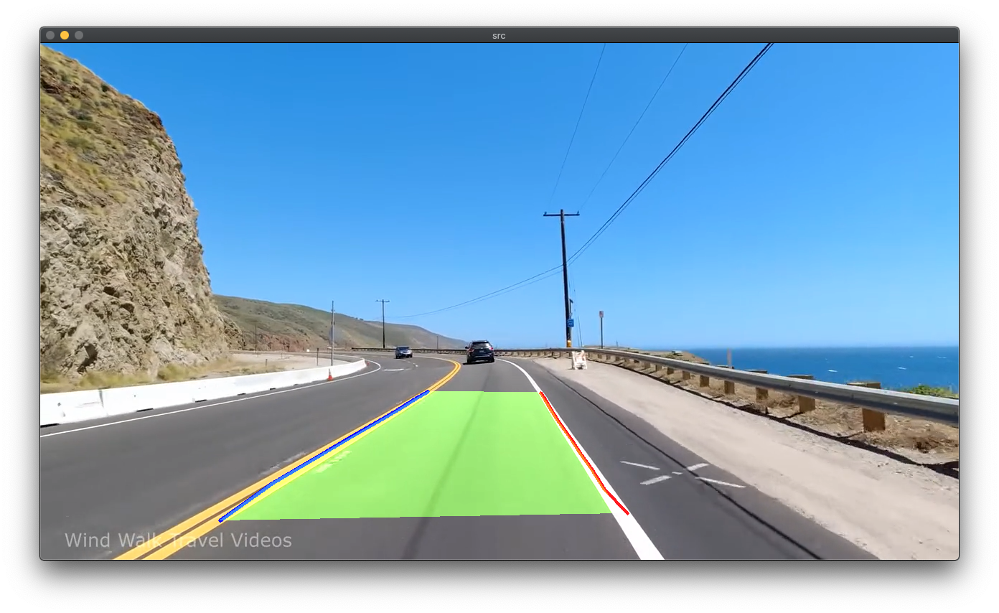
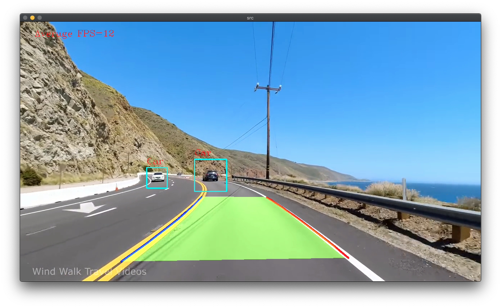

# OpenCV-LaneKeeping
My attempt on Lane Keeping with OpenCV in C++. Wish me good luck!

Thanks Jan Haložan, i followed this blog post for v0.2 @ https://janhalozan.com/2019/06/01/lane-detector/

### Status
### v 0.1
- [x] Region Of Interest (ROI) 
- [x] ROI To Grayscale
- [x] ROI To Canny (Edge Detection)
- [x] ROI Gaussian Blur
- [x] ROI Back to BGR
- [x] Merge ROI back to source frame 
### v 0.2
- [x] Draw Lanes
- [x] Remove ROI from source frame and just keep the lanes
### v 0.3
- [x] Object Detect Cars using cascade(followed this blog post: https://themadphysicist.com/vehicle-detection-w-opencv-haar-cascades/)
- [ ] Feedback from the program to control the vehicle between the lanes 

## Screenshots
v 0.1

v 0.2

v 0.3
